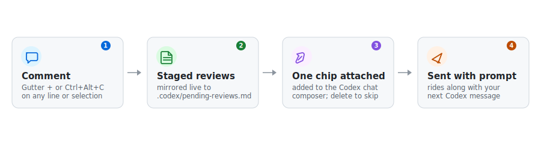

# Codex Reviewer

A companion extension for the official Codex VS Code extension (`openai.chatgpt`) that brings GitHub PR-style review comments to your editor. Comment on any line or selection — in a diff view or a regular file — and the notes stay staged inside VS Code. When the batch is ready, one click attaches it to the Codex chat composer as a single file chip that travels with your next prompt. Delete the chip and the reviews stay behind.



[中文介绍](README.zh-CN.md)

## How it works

1. Hover a line's gutter and click **+**, or select a range and press `Ctrl+Alt+C` (`Cmd+Alt+C` on macOS). Write as many notes as you like; the status bar keeps count.
2. Click the status bar item (or the send button in a diff editor's title bar). The extension writes the staged notes to a mirror file and attaches it to the Codex composer through the Codex extension's own `chatgpt.addFileToThread` command.
3. Send a message in Codex as usual — the chip's content goes with it. Then run `Codex Reviewer: Clear Staged Reviews` to start a fresh round.

The chip points to a real file (default `.codex/pending-reviews.md` in your workspace) that the extension rewrites on every change, so notes added after attaching are still current when you hit send.

## What the agent receives

Each note becomes one objective citation: path, line range, side (the old side of a diff carries the commit SHA, the new side carries HEAD), the verbatim code, and your note text. No instructions are attached — whether the agent should explain the code or change it stays entirely up to your conversation.

```md
## [ref #1] src/foo.ts:40-42

working tree (HEAD `1a2b3c4d5e`)

​```typescript
const a = 1;
const b = 2;
return a + b;
​```

> why is `b` added here?
```

## Requirements

- VS Code ≥ 1.96
- The official Codex extension (`openai.chatgpt`), installed and signed in

## Install

```bash
npm install
npm run compile   # esbuild → out/extension.js
```

Then package with `npx vsce package` and install via `code --install-extension`, or copy `package.json`, `out/`, and `README.md` into `~/.vscode/extensions/nihildigit.codex-reviewer-0.1.0/`. For development, open this folder and press `F5`, or run `code --extensionDevelopmentPath=<this repo> <a workspace>`.

## Usage

| Action | Result |
| --- | --- |
| Hover the gutter, click **+** | Comment on that line (regular editors and both sides of a diff) |
| `Ctrl+Alt+C` (`Cmd+Alt+C`) | New Codex comment on the selection, or on the cursor line when nothing is selected |
| Click the status bar item | Attach all staged reviews to the Codex composer |
| Thread title buttons | Send or delete a thread; single notes can be deleted individually |

Command palette: `Codex Reviewer: Clear Staged Reviews` and `Codex Reviewer: Open Pending Reviews File`.

Why the shortcut exists: the gutter **+** belongs to VS Code core. When several comment providers (e.g. GitHub Pull Requests) match the same line it shows a provider picker, and extensions cannot listen for modifier-key clicks on it. `Ctrl+Alt+C` creates the thread directly on this extension's own controller and skips the picker. Rebind it in Keyboard Shortcuts.

## Settings

- `codexReviewer.pendingFile` (default `.codex/pending-reviews.md`): workspace-relative path of the reviews file.
- `codexReviewer.gitExclude` (default `true`): on activation, adds the reviews file to the repository's `.git/info/exclude` so `git status` stays clean. Handles worktree/submodule `.git` pointers; skipped outside git repositories.

## Known limitations

- **Deleted lines can't be commented in inline diff mode.** They are rendered as virtual lines with no comment anchor — a VS Code platform limitation. Use the diff editor's `…` menu → Toggle Inline View, and comment on the left (old) file in side-by-side mode; the note is captured as `old side @ commit <sha>` with the removed code included.
- **The comment widget is not styleable.** Its size is fixed by VS Code's core comment component, and with word wrap the gutter + follows the mouse onto every visual row of a wrapped line. Clicking any of them anchors the same logical line.
- The chip shows the file name, not the review count — the status bar has the count.
- The Codex extension exposes no "message sent" event, so clearing staged reviews after sending is a manual step.
- Comment threads live in memory: reloading the window resets threads and the staged set (the reviews file keeps its last content and is rewritten on the next change).
- The terminal `codex` TUI has no composable input API; only the official extension's chat composer is supported.

## License

MIT © NihilDigit
